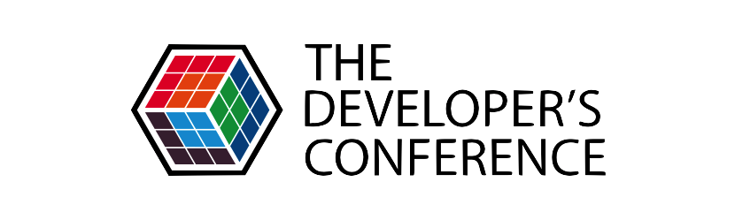
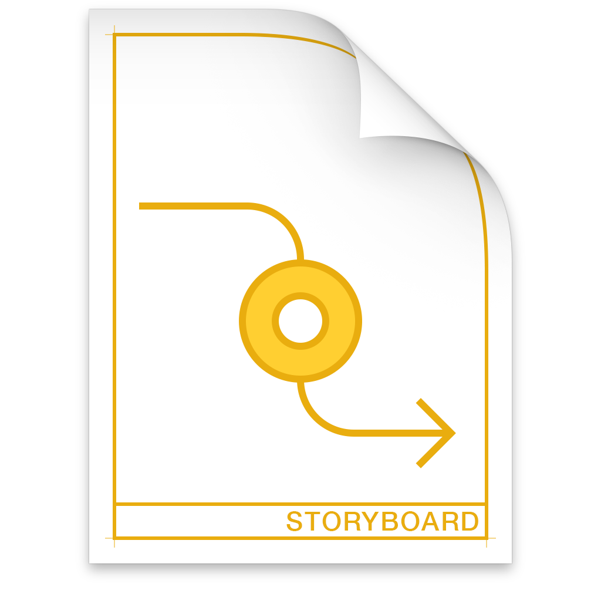
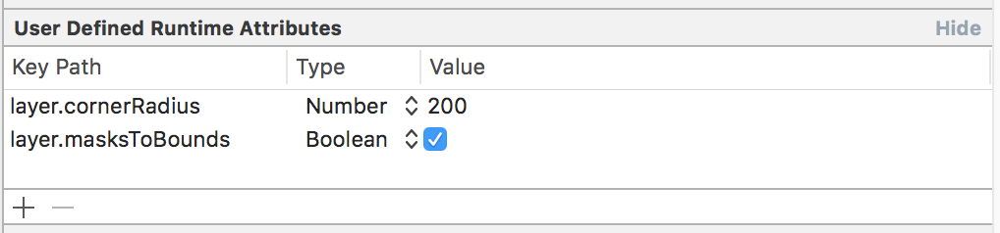
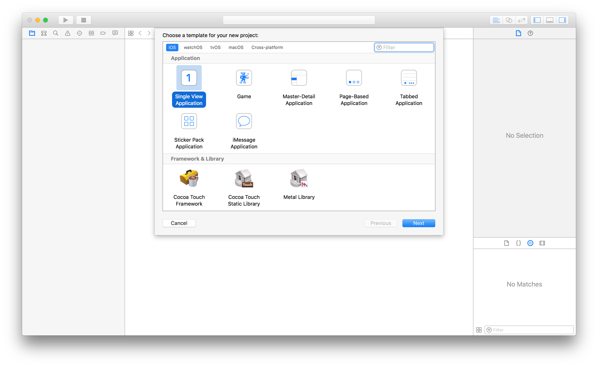
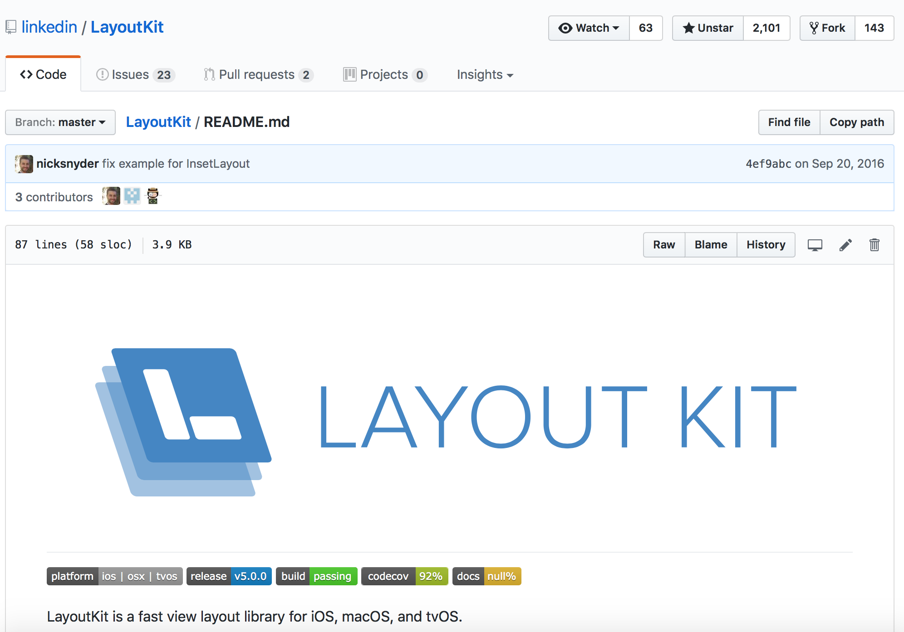
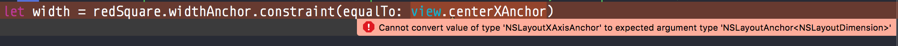
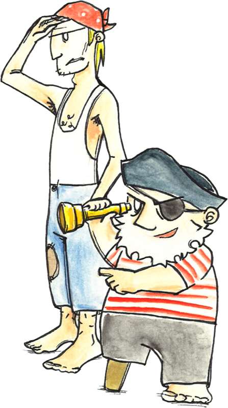
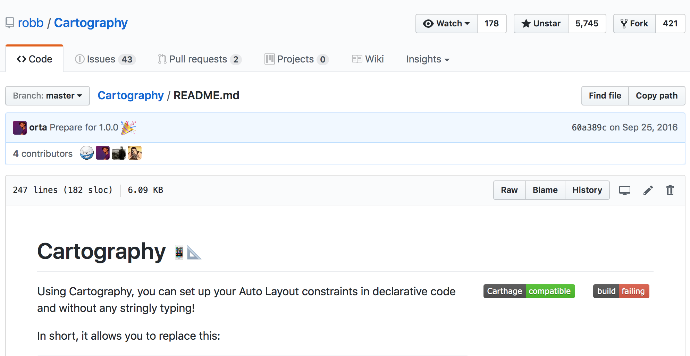
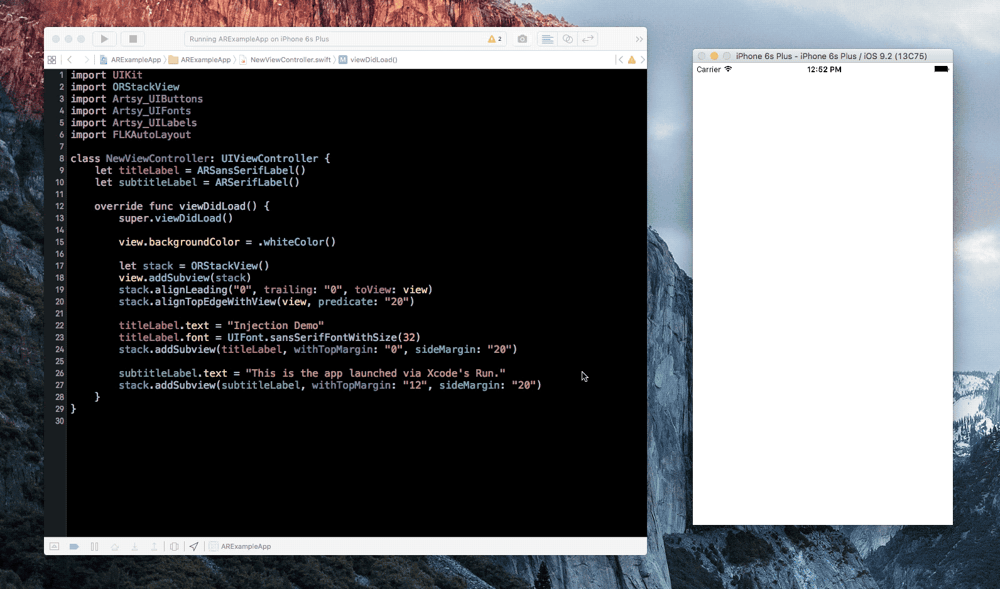
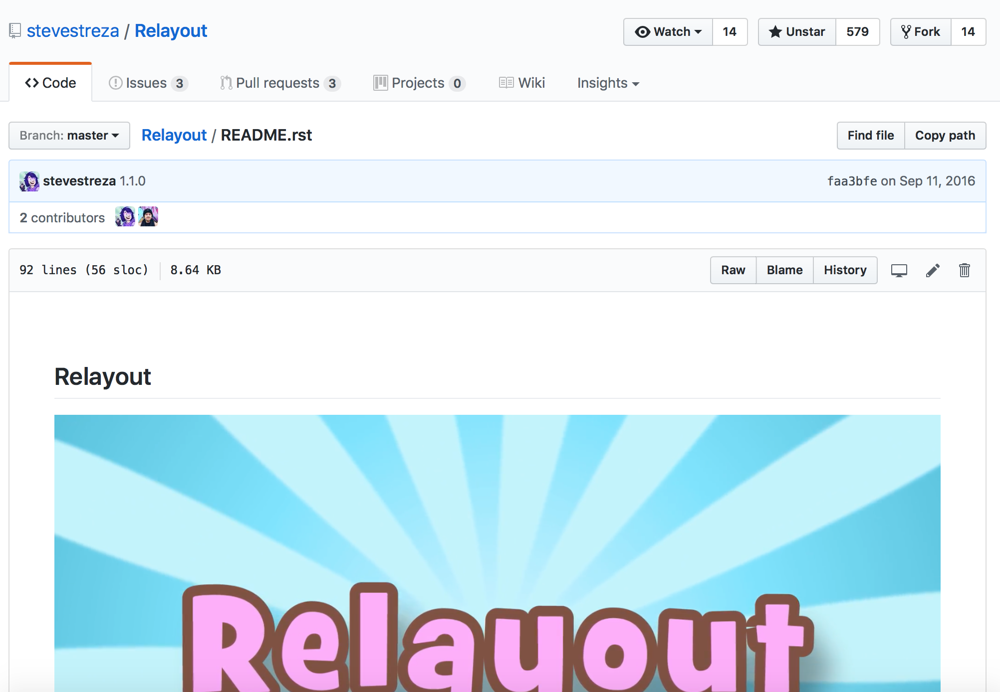

# The Developer's Conference

---


# The Developer's Conference

## *Francesco Perrotti-Garcia*

---

#[fit] Layout por código: 
#[fit] aumentando sua **produtividade**
#[fit] e **reuso** de código

---


#[fit] *Francesco* 
#[fit] *Perrotti-Garcia*
#[fit] iOS Developer
#[fit] **_@fpg1503_**

---

#[fit] >> 🙋🙋‍♂️ <<

---

#[fit] `UIKit`

---



---

#[fit] Layout por código

---

#[fit] 💙 SB

---

#[fit] 💔 SB

---

#[fit] 😐 SB

---

#[fit] Problemas do
#[fit] Storyboard

---

#[fit] Injeção de dependências

---

#[fit] Acoplamento

---

#[fit] Stringly typed APIs

---



---

#[fit] Padronização

---

#[fit] Setar em cada label

---

#[fit] Mudar 👎 Previsão 👍

---

#[fit] Appearance Proxy

---

#[fit] Mudar 👍 Previsão 👎

---

#[fit] 🎃`Aa`

---

#[fit] **Não** é confiável

---



---

#[fit] Layout programático

---

#[fit] 📖📱🖥

---

#[fit] **2007** iPhone

---

#[fit] **2008** iPhone 3G

---

#[fit] **2009** iPhone 3GS

---

#[fit] 320 × 480

---

#[fit] **2010** iPhone 4

---

#[fit] 640 × 960

---

#[fit] 2(320 × 480)

---

#[fit] 👁👁

---

#[fit] **2011** iPhone 4S

---

#[fit] **2011** Lion Autolayout

---

#[fit] **2012** iPhone 5

---

#[fit] **2014** iPhone 6(+)

---

#[fit] Números mágicos

---

#[fit] AutoResizingMask

---

#[fit] AutoLayout

---

#[fit] Declarativo

---

#[fit] Constraints

---

`item1.attribute1 = multiplier × item2.attribute2 + constant`

---

`item1.attribute1 >= multiplier × item2.attribute2 + constant`

---

`item1.attribute1 <= multiplier × item2.attribute2 + constant`

---

#[fit] Sistema de inequações

---

#[fit] Prioridades

---

#[fit] Content Hugging

---

#[fit] Content Compression Resistance

---

#[fit] complexidade desnecessária

---

#[fit] Googleabilidade

---



---

#[fit] Mini demo

---

#[fit] ⬜️ **vermelho**
#[fit] metade da largura da tela

---

#[fit] Criando no Storyboard

---

#[fit] `NSLayoutConstraint`

---

```swift
init(item: Any,
  attribute: NSLayoutAttribute,
  relatedBy: NSLayoutRelation,
  toItem: Any?,
  attribute: NSLayoutAttribute,
  multiplier: CGFloat,
  constant: CGFloat)
```

---

```swift, [.highlight: 1, 4]
init(item: Any,
  attribute: NSLayoutAttribute,
  relatedBy: NSLayoutRelation,
  toItem: Any?,
  attribute: NSLayoutAttribute,
  multiplier: CGFloat,
  constant: CGFloat)
```

---

```swift
NSLayoutContraint(item: "Oops",
  ...
```

---

#[fit] >> 👎 <<

---

```swift, [.highlight: 2, 5]
init(item: Any,
  attribute: NSLayoutAttribute,
  relatedBy: NSLayoutRelation,
  toItem: Any?,
  attribute: NSLayoutAttribute,
  multiplier: CGFloat,
  constant: CGFloat)
```

---

#[fit] `NSLayoutAttribute`

---

```swift
public enum NSLayoutAttribute : Int {
    case left
    case right
    case top
    case bottom
    case leading
    case trailing
    case width
    case height
    case centerX
    case centerY
    case lastBaseline
    case firstBaseline
    case leftMargin
    case rightMargin
    case topMargin
    case bottomMargin
    case leadingMargin
    case trailingMargin
    case centerXWithinMargins
    case centerYWithinMargins    
    case notAnAttribute
}
```

---

```swift
public enum NSLayoutAttribute : Int {
    case left
    case right
    case top
    case bottom
    case leading
    case trailing
    case width
    case height
    case centerX
    case centerY
    case notAnAttribute
}
```

---

#[fit] If a constraint only has one item, 
#[fit] set the second item to `nil`, and 
#[fit] set the second attribute to 
#[fit] `NSLayoutAttributeNotAnAttribute`.

---

#[fit] ⬜️ **vermelho**
#[fit] metade da largura da tela

---

```swift
let width = NSLayoutConstraint(item: redSquare,
                                attribute: .width,
                                relatedBy: .equal,
                                toItem: view,
                                attribute: .width,
                                multiplier: 0.5,
                                constant: 0)
```

---

```swift, [.highlight: 2, 5-6]
let width = NSLayoutConstraint(item: redSquare,
                                attribute: .width,
                                relatedBy: .equal,
                                toItem: view,
                                attribute: .width,
                                multiplier: 0.5,
                                constant: 0)
```

---

#[fit] `0.5 × width` é
#[fit] o `centerX`

---

```swift, [.highlight: 2, 5-6]
let width = NSLayoutConstraint(item: redSquare,
                                attribute: .width,
                                relatedBy: .equal,
                                toItem: view,
                                attribute: .centerX,
                                multiplier: 1,
                                constant: 0)
```

---

````
*** Terminating app due to uncaught exception
'NSInvalidArgumentException', reason: 
'NSLayoutConstraint for<UIView: 0x7fd7e0d032d0;
frame = (0 0; 0 0); layer = <CALayer: 0x60800003ec00>>: 
Invalid pairing of layout attributes.'
```

---

#[fit] Mal tipada

---

#[fit] **Swift** era para ser
#[fit] *seguro*

---


---

#[fit] `iOS 9`

---

#[fit] `NSLayoutAnchor`

---

```swift
let centerX = NSLayoutConstraint(item: redSquare,
                                  attribute: .centerX,
                                  relatedBy: .equal,
                                  toItem: view,
                                  attribute: .centerX,
                                  multiplier: 1,
                                  constant: 0)
```

---

```swift
let centerX = redSquare
  .centerXAnchor
  .constraint(equalTo: view.centerXAnchor)
```

---

```swift
let centerX = NSLayoutConstraint(item: redSquare,
                                         attribute: .centerX,
                                         relatedBy: .equal,
                                         toItem: view,
                                         attribute: .centerX,
                                         multiplier: 1,
                                         constant: 0)
        
let centerY = NSLayoutConstraint(item: redSquare,
                                  attribute: .centerY,
                                  relatedBy: .equal,
                                  toItem: view,
                                  attribute: .centerY,
                                  multiplier: 1,
                                  constant: 0)

let aspectRatio = NSLayoutConstraint(item: redSquare,
                                      attribute: .width,
                                      relatedBy: .equal,
                                      toItem: redSquare,
                                      attribute: .height,
                                      multiplier: 1,
                                      constant: 0)

let width = NSLayoutConstraint(item: redSquare,
                                attribute: .width,
                                relatedBy: .equal,
                                toItem: view,
                                attribute: .centerX,
                                multiplier: 1,
                                constant: 0)

let constraints = [centerX, centerY, aspectRatio, width]
constraints.forEach {
    $0.isActive = true
}

view.translatesAutoresizingMaskIntoConstraints = false
redSquare.translatesAutoresizingMaskIntoConstraints = false
```

---

```swift
let centerX = redSquare.centerXAnchor.constraint(equalTo: view.centerXAnchor)
let centerY = redSquare.centerYAnchor.constraint(equalTo: view.centerYAnchor)
let aspectRatio = redSquare.widthAnchor.constraint(equalTo: redSquare.heightAnchor)
let width = redSquare.widthAnchor.constraint(equalTo: view.widthAnchor, multiplier: 0.5)


let constraints = [centerX, centerY, aspectRatio, width]
NSLayoutConstraint.activate(constraints)

view.translatesAutoresizingMaskIntoConstraints = false
redSquare.translatesAutoresizingMaskIntoConstraints = false
```

---



---

#[fit] `.constraint(equalToConstant: CGFloat)`

---

#[fit] DSL

---



---

#[fit] Cartography

---



---

```swift
constrain(redSquare, view) { redSquare, view in
  redSquare.center == view.center
  redSquare.width == redSquare.height
  view.width == redSquare.width * 2
}
```

---

#[fit] >> 📚 <<

---

#[fit] `.activate(constraint)`
#[fit] `constraint.isActive = true`

---

#[fit] `translatesAutoresizingMaskIntoConstraints`

---

#[fit] `item.attribute {operator} {expression}`

---

#[fit] `view.height == 123`

---

#[fit] `view.translatesAutoresizingMaskIntoConstraints = false`

---

```swift, [.highlight: 4]
constrain(redSquare, view) { redSquare, view in
  redSquare.center == view.center
  redSquare.width == redSquare.height
  view.width == redSquare.width * 2
}
```

---

#[fit] `UIStackView`

---

#[fit] 🥀🥀

---

#[fit] `UITableViewCell`

---

#[fit] `contentView`

---

#[fit] `View` do `ViewController`

---

#[fit] ⛓

---

```swift
override func didMoveToSuperview() {
    super.didMoveToSuperview()
    guard let superview = superview else {
        return
    }

    constrain(self, superview) { view, superview in
        view.edges == superview.edges
    }
}
```

---

#[fit] Injetar
#[fit] `StyleProvider`

---

#[fit] 📏⌨️🎨

---

#[fit] Definir estilos
#[fit] *consistentes*

---

```swift
enum Style {
  case text
  ...
}
```

---

```swift
protocol StyleProvider {
  func color(for style: Style)
  func font(for style: Style)
}
```

---

```swift
  func color(for style: Style) {
    switch style {
      case .text: return .black
      ...
    }
  }
```

---

```swift, [.highlight: 3]
  func color(for style: Style) {
    switch style {
      case .text: return .black
      ...
    }
  }
```
---

```swift, [.highlight: 3-9]
  func color(for style: Style) {
    switch style {
      if Date().isHalloween {
        case .text: return .orange
        ...
      } else {
        case .text: return .black
        ...
      }
    }
  }
```

---

```swift
  func color(for style: Style) {
    switch style {
      if Date().isHalloween {
        case .text: return .orange
        ...
      } else {
        case .text: return .black
        ...
      }
    }
  }
```

---

#[fit] `johnno1962/InjectionForXcode`

---



---

#[fit] Size classes?

---



---

#[fit] Perguntas?

---

#[fit] Obrigado!

----

#[fit] @fpg1503

---

#[fit] `github.com/fpg1503/ProgrammaticLayoutTalk`